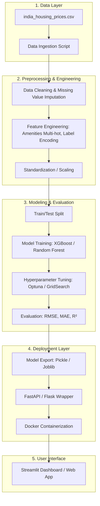

# 🏗️ Indian Housing Price Prediction - Project Architecture

This document outlines the end-to-end architecture for building a robust Machine Learning system to predict house prices in India.

---

## 📐 System Overview

The system follows a modular architecture consisting of five primary layers: Data, Preprocessing, Modeling, Deployment, and User Interface.

---

## 🛠️ Detailed Component Breakdown

### 1. Data Layer
*   **Source**: Static CSV file containing ~10,000+ records of Indian property listings.
*   **Features**: Includes location (City, Locality), structural (BHK, Size, Floor), and environmental (Nearby Schools/Hospitals) data.

### 2. Preprocessing & Feature Engineering
*   **Handling Categorical Data**: 
    *   `Locality` & `City`: Use Target Encoding or Frequency Encoding due to high cardinality.
    *   `Property_Type`, `Furnished_Status`: One-Hot Encoding.
    *   `Amenities`: Multi-label binarization (converting "Pool, Gym" into separate binary columns).
*   **Numerical Transformation**: Scaling `Size_in_SqFt` and `Age_of_Property` to bring them to a common scale.
*   **Outlier Detection**: Using IQR or Z-score to remove unrealistic price listings.

### 3. Modeling Strategy
*   **Algorithm**: Gradient Boosted Trees (XGBoost/LightGBM) are preferred for tabular data with non-linear relationships.
*   **Feature Importance**: SHAP values or built-in importance plots to identify the top drivers (e.g., Area vs Locality).
*   **Cross-Validation**: 5-fold stratified cross-validation to ensure model stability across different city tiers.
*   **Metric**: **MAE (Mean Absolute Error)** will be the primary business metric, as it represents the average error in Lakhs.

### 4. Deployment & API
*   **Framework**: **FastAPI** for high-performance asynchronous request handling.
*   **Payload**: Accepts property features (JSON) and returns a predicted price with a confidence interval.
*   **Versioning**: MLflow or simple directory-based versioning to track different model iterations.

### 5. Application Layer (Streamlit)
*   **Buyer Mode**: Enter property details to see if a quoted price is "Fair", "Overpriced", or a "Steal".
*   **Seller Mode**: Estimate the optimal listing price based on current market trends in their locality.

---

## 🔄 Lifecycle & Maintenance
*   **Model Retraining**: Triggered monthly or when new data is scraped.
*   **Drift Monitoring**: Tracking if the average predicted price diverges significantly from actual market trends.
